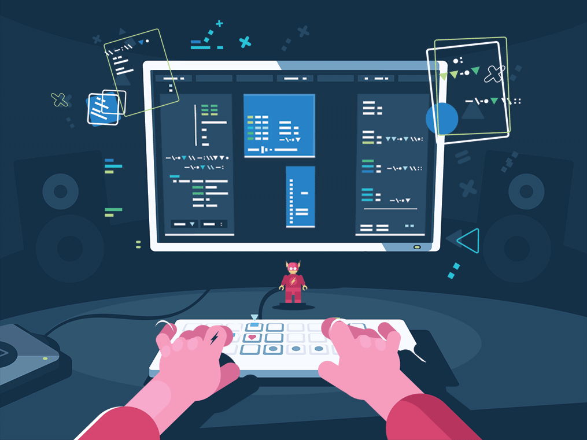

<!-- Banner -->

  

<h1 align="center">Hi 👋, I'm Supriya Kumari</h1>

<h3 align="center">
AI & Machine Learning Enthusiast • Data Analyst • Python Developer
</h3>

Passionate about Artificial Intelligence, Machine Learning, Data Analytics and building intelligent applications.

---

## 👩‍💻 About Me

🎓 **B.E. Computer Science (AI & ML)** – Chandigarh University

💼 Machine Learning Intern at **Nodesio Corp Pvt. Ltd.**

📊 Former Data Science Intern at **Celebal Technologies**

🤖 Former Machine Learning Intern at **Cognifyz Technologies**

🌱 Currently learning

- Deep Learning
- Generative AI
- Large Language Models (LLMs)
- Data Engineering

💡 Interested in

- Artificial Intelligence
- Machine Learning
- Data Analytics
- Computer Vision
- IoT Solutions

📫 **Email:** **k.supriya14oct@gmail.com**

---
